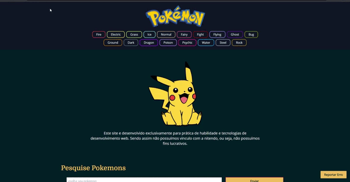

# pokedex

     Projeto de pokédex desenvolvido para pratica de consumo de API, utilzando axios;
       
     <a target="_blank" href="https://pokeapi.co/">PokeAPI</a>;
       
     Mobile:   ;
      
     Desktop:   ;

